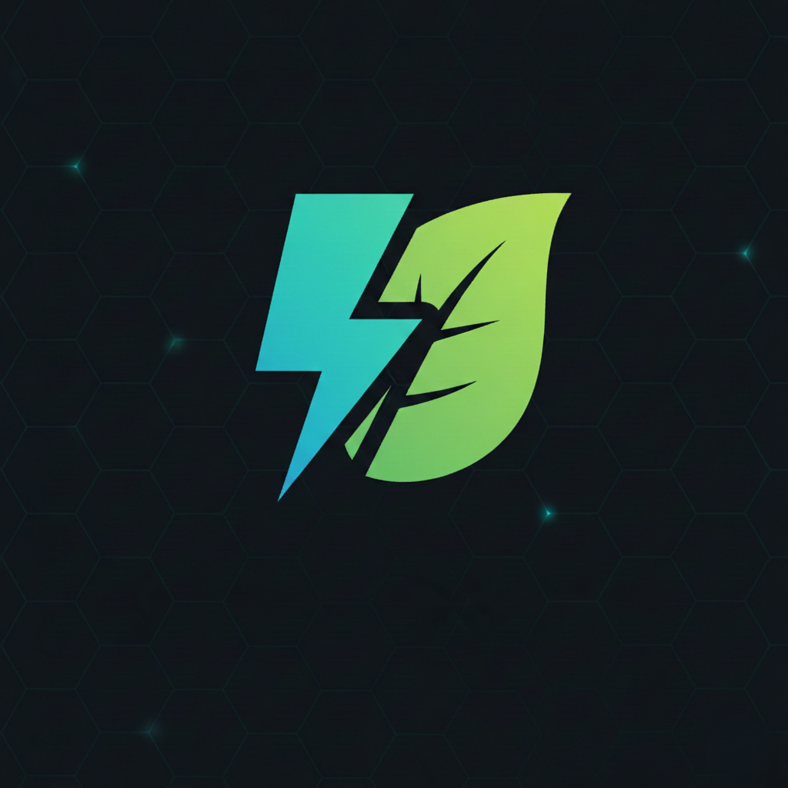

# Brain Tumor Backend

<p align="center">
  
</p>

This project is a high-performance backend built with Python and MongoDB, designed to support brain tumor detection applications. It provides a set of robust RESTful APIs for storing, retrieving, and processing medical imaging data. Optimized for speed and scalability, it ensures efficient handling of large datasets while maintaining secure and reliable access for AI-driven tumor detection workflows.


## Get started

```bash
# Clone the repository
git clone https://github.com/Amin-0513/brain-tumor-backend.git

# Navigate to project directory
cd brain-tumor-backend

# create python environment
python -m venv .venv

# activate python environment
.venv\Scripts\activate

pip uninstall -y jose;
pip install 'python-jose[cryptography]';

uvicorn main:app --host 127.0.0.1 --port 8000 --reload
```
