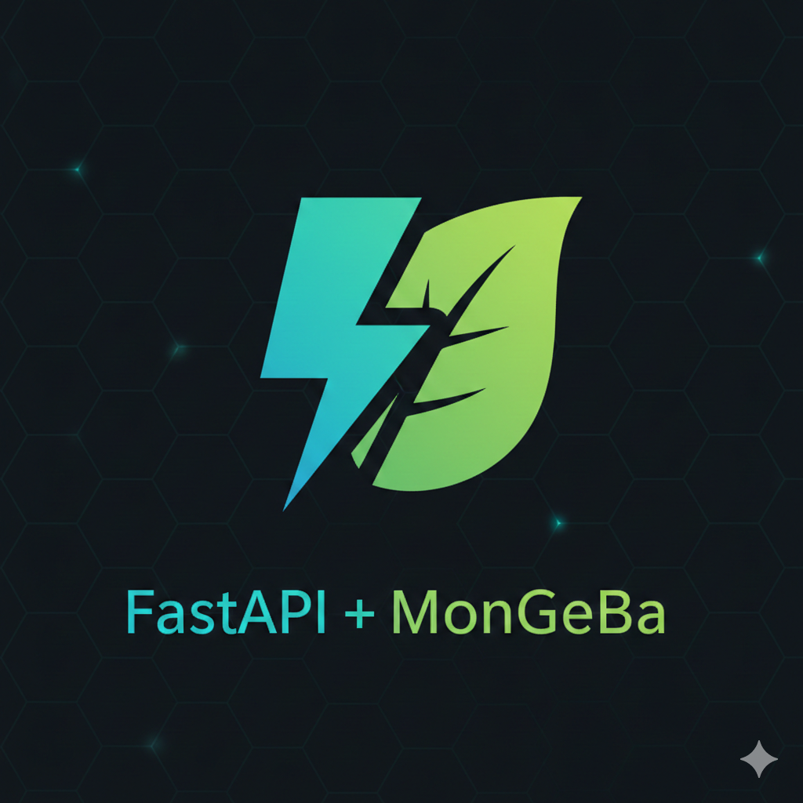

# Brain Tumor Backend

  

This project is a high-performance backend built with Python and MongoDB, designed to support brain tumor detection applications. It provides a set of robust RESTful APIs for storing, retrieving, and processing medical imaging data. Optimized for speed and scalability, it ensures efficient handling of large datasets while maintaining secure and reliable access for AI-driven tumor detection workflows.
